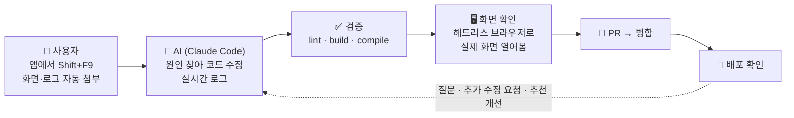
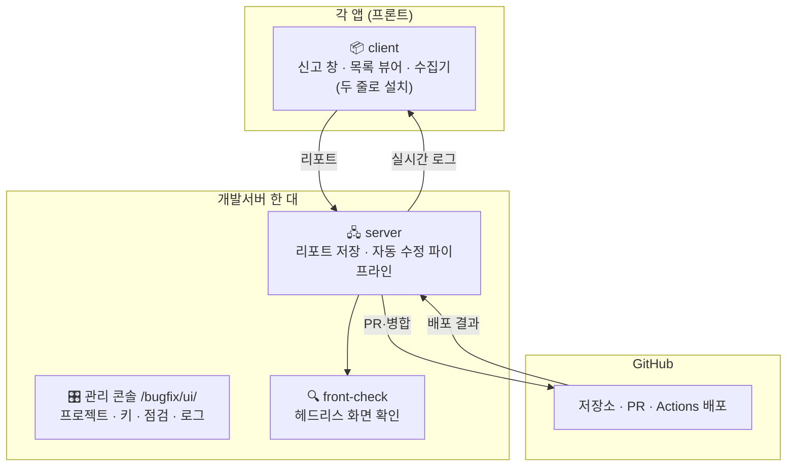
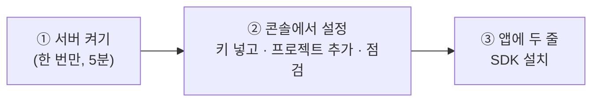
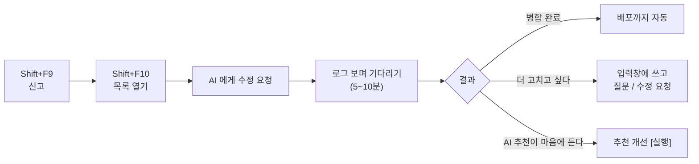

# bugfix-kit

> **앱에서 버그를 신고하면, AI 가 고쳐서 배포까지 해 줍니다.**



리포트 하나에 **5~10분**, 비용 **$0.5~1**. Vue·React·순수 HTML 어디에나 붙습니다.

---

## 구성



---

## 시작하기 — 3단계



### ① 서버 켜기

```bash
git clone https://github.com/hskim2515/bugfix-kit.git ~/bugfix-kit && cd ~/bugfix-kit && npm install
cp packages/server/bugfix-kit.example.yml packages/server/bugfix-kit.yml
mkdir -p ~/.config/bugfix-kit && (umask 077; echo "ADMIN_KEY=$(openssl rand -hex 16)" > ~/.config/bugfix-kit/default.env)
claude login                                                   # 터미널에서 한 번
docker pull mcr.microsoft.com/playwright:v1.47.2-jammy
cp packages/server/deploy/bugfix-server.service ~/.config/systemd/user/
systemctl --user daemon-reload && systemctl --user enable --now bugfix-server && loginctl enable-linger $USER
```
nginx: `location ^~ /bugfix/ { proxy_pass http://127.0.0.1:8790/api/; client_max_body_size 60m; }`

### ② 관리 콘솔 `https://앱주소/bugfix/ui/`

첫 화면의 **시작 체크리스트**가 남은 일을 알려 줍니다.

| 탭 | 한 줄 요약 |
|---|---|
| 🔑 키·계정 | GitHub 토큰, 테스트 계정 넣기 |
| 📁 프로젝트 | 저장소 주소·브랜치·검증 명령 적고 저장 |
| 🩺 점검 | 버튼 눌러서 잘 붙었는지 확인 |
| 📋 리포트 | 신고 현황, 진행 중 로그, 리포트 열어 보기(수정 뒤 화면 확인 스크린샷 포함) |
| 💡 제안 | AI 가 리포트·커밋·코드·**헤드리스로 열어 본 화면**을 보고 고칠 점을 먼저 찾음. 제안만 하고 코드는 안 건드림 |
| 🧭 지식 | 프로젝트 **지식 그래프**(메뉴 → 기능 → 파일 → API → 백엔드). 연결되면 자동 구축, 병합될 때마다 갱신. 수정·질문·제안 때 AI 가 참고 |

비밀값은 서버 홈에만 저장됩니다. 저장소에는 절대 안 들어갑니다.

### ③ 앱에 두 줄

```bash
npm i -D github:hskim2515/bugfix-kit#v0.1.37 && npx front-check init
```
```js
// Vue
import { createBugfix } from 'bugfix-kit/client/vue'; import 'bugfix-kit/client/style.css';
export const kit = createBugfix({ endpoint: '/bugfix', project: 'myapp', apiKey: '…', interceptors: { console: true, network: { axios: [rest] }, mutation: store, router } });
// React / HTML
import { createBugfix } from 'bugfix-kit/client';
export const kit = createBugfix({ endpoint: '/bugfix', project: 'myapp', apiKey: '…', interceptors: { console: true, network: { fetch: true }, router: true } }).mount();
```

끝. **Shift+F9** 신고 · **Shift+F10** 목록.

---

## 사용자는 이것만



---

## 자주 묻는 것

| 질문 | 답 |
|---|---|
| 백엔드도 고치나요? | 네, 같은 저장소면 프론트·백엔드 다. 백엔드 검증은 컴파일·테스트까지 |
| 신고 창 자체가 이상하면? | 신고 창의 **버그 신고 도구 문제** 를 체크해 신고. 같은 프로젝트에 '도구' 표시로 남고 AI 수정 대상은 아님(운영자가 도구 저장소에서 처리) |
| 운영 서버에 영향은? | 없음. 개발 저장소·브랜치만 건드리고, front-check 는 운영 주소 요청을 차단 가능 |
| 개인정보는? | 신고자·문제 원문은 PR 에 안 들어감. 인증값 마스킹, AI 에겐 추린 로그만 |
| 서버를 재시작하면? | 끊긴 작업은 재시작 뒤 자동으로 다시 큐에 들어감(PR 을 올린 뒤면 그대로). 앱 서버 재배포와는 무관 |
| 프론트/백엔드 저장소가 다르면? | 프로젝트 두 개로 등록하고 신고할 때 대상 선택 |
| 지식 그래프는 언제 갱신되나요? | 처음 연결될 때 자동 구축, 수정이 병합될 때마다 바뀐 파일만 갱신, 그리고 `knowledge.schedule: "04:00"` 같은 예약. 콘솔 지식 탭에서 검색·수동 갱신 |
| 화면 확인 스크린샷은 어디에? | 수정 뒤 front-check 가 찍은 것은 그 리포트의 AI 자동 수정 칸에, 제안 분석 때 찍은 것은 제안 탭 위에. 서버 `{dataDir}/{project}/shots/` 에 최근 회차만 보관 |

문제가 생기면 콘솔 **점검** 탭과 **로그** 탭. 서버 갱신: `~/bugfix-kit/packages/server/deploy/update.sh` (돌던 작업이 끝나길 기다렸다가 재시작. 끊긴 작업은 재시작 뒤 자동으로 다시 큐에)

자세한 옵션: [server](packages/server) · [client](packages/client) · [front-check](packages/front-check)
