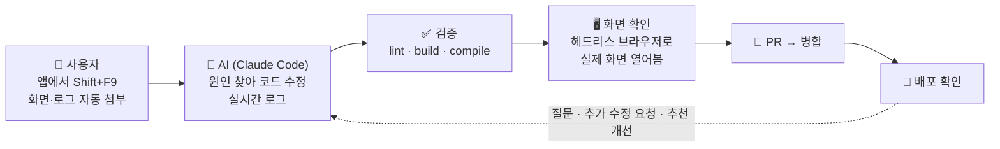
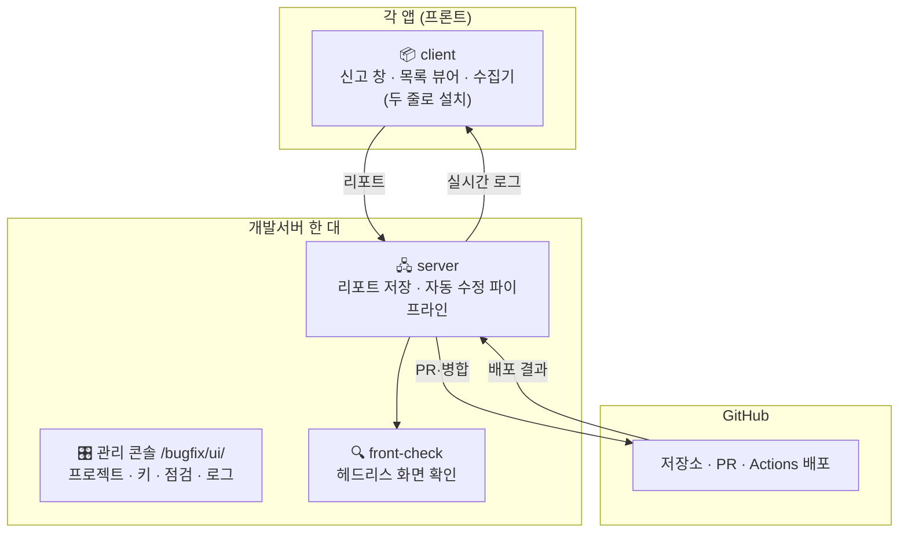
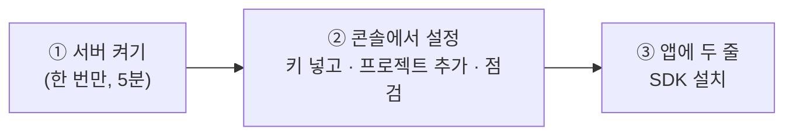
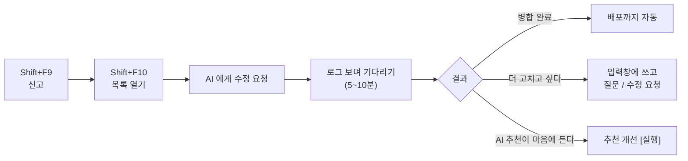

# bugfix-kit

> **앱에서 버그를 신고하면, AI 가 고쳐서 배포까지 해 줍니다.**



리포트 하나에 **5~10분**, 비용 **$0.5~1**. Vue·React·순수 HTML 어디에나 붙습니다.

---

## 구성



---

## 시작하기 — 3단계



### ⓪ 백엔드가 Node 라면 — 서버 없이 앱에 내장

```js
import { bugfixKit } from 'bugfix-kit/embed';
app.use('/bugfix', bugfixKit());          // 신고 API · 콘솔(/bugfix/ui/) · AI 수정 파이프라인 전부. 앱과 같이 뜨고 같이 갱신된다
```
package.json 한 줄 + 이 한 줄. 프로젝트 이름·저장소·브랜치·검증 명령은 package.json 과 git remote 에서 알아서 읽고, 설정은 `.bugfix-data/`(gitignore) 에 둔다.
그 기계에 git·Claude Code CLI(로그인)·빌드 도구가 있으면 된다. 저장소 토큰은 `BUGFIX_GITHUB_TOKEN` / `GITLAB_TOKEN` 환경변수. 프론트는 아래 ③ 의 플러그인 한 줄(endpoint 는 `/bugfix`).
Spring 백엔드는 **스타터 한 줄**: `implementation 'com.github.hskim2515:bugfix-kit:v0.1.68'` (JitPack). 최근 로그 끝점·`/bugfix/**` 프록시·보안 허용이 자동으로 붙고, 그 호스트에 Node 가 있으면 bugfix-kit 워커까지 앱과 같이 띄운다([spring-boot-starter](packages/spring-boot-starter)). Node 가 없는 컨테이너 배포는 `bugfix.server` 로 ①② 의 인스턴스를 가리킨다.

### ① 서버 켜기 — **앱 하나에 인스턴스 하나**

코드는 한 번만 받고, 앱마다 인스턴스(포트·데이터·콘솔이 따로)를 띄웁니다. 같은 개발서버에 앱이 여럿이면 인스턴스를 그만큼.

```bash
git clone https://github.com/hskim2515/bugfix-kit.git ~/bugfix-kit && cd ~/bugfix-kit && npm install   # 처음 한 번
mkdir -p ~/.config/bugfix-kit && (umask 077; echo "ADMIN_KEY=$(openssl rand -hex 16)" > ~/.config/bugfix-kit/default.env)
claude login                                                   # 터미널에서 한 번
docker pull mcr.microsoft.com/playwright:v1.47.2-jammy
loginctl enable-linger $USER
packages/server/deploy/new-instance.sh myapp 8790              # 앱마다: 이름·포트 → bugfix-server@myapp
```
앱 nginx: `location ^~ /bugfix/ { proxy_pass http://127.0.0.1:8790/api/; client_max_body_size 60m; }` (인스턴스 포트로)
갱신: `packages/server/deploy/update.sh` 가 코드를 받고 인스턴스마다 큐가 비면 재시작합니다.

### ② 관리 콘솔 `https://앱주소/bugfix/ui/`

첫 화면의 **시작 체크리스트**가 남은 일을 알려 줍니다.

| 탭 | 한 줄 요약 |
|---|---|
| 🔑 키·계정 | GitHub 토큰, 테스트 계정 넣기 |
| 📁 프로젝트 | 저장소 주소·브랜치·검증 명령 적고 저장 |
| 🩺 점검 | 버튼 눌러서 잘 붙었는지 확인 |
| 📋 리포트 | 신고 현황, 진행 중 로그, 리포트 열어 보기(수정 뒤 화면 확인 스크린샷 포함) |
| 💡 제안 | AI 가 리포트·커밋·코드·**헤드리스로 열어 본 화면**을 보고 고칠 점을 먼저 찾음. 제안만 하고 코드는 안 건드림 |
| 🧭 지식 | 프로젝트 **지식 그래프**(메뉴 → 기능 → 파일 → API → 백엔드). 연결되면 자동 구축, 병합될 때마다 갱신. 수정·질문·제안 때 AI 가 참고 |

비밀값은 서버 홈에만 저장됩니다. 저장소에는 절대 안 들어갑니다.

### ③ 앱에 붙이기 — 플러그인 한 줄

```bash
npm i -D github:hskim2515/bugfix-kit#v0.1.47
```
```js
// vite.config.js (Vite 앱: React·Vue·Svelte…)
import bugfixKit from 'bugfix-kit/vite';
export default defineConfig({ plugins: [react(), bugfixKit({ restBase: '/rest', server: 'http://개발서버:8791' })] });
```
```js
// vue.config.js (Vue CLI / webpack 앱)
const bugfixKit = require('bugfix-kit/webpack');
module.exports = { configureWebpack: { plugins: [bugfixKit({ project: 'myapp', restBase: () => process.env.VUE_APP_REST_SERVER })] } };   // 키(VUE_APP_BUGFIX_KEY)가 없는 빌드는 자동으로 꺼짐
```
이게 전부입니다. 플러그인이 SDK 를 index.html 에 자동으로 넣고(콘솔·fetch/XHR·주소 변화·큰 캔버스 캡처), 신고 서버 주소를 정하고, `앱주소/bugfix/` 로 들어오면 콘솔로 보내 줍니다. 키는 `.env` 의 `VITE_BUGFIX_KEY`.
백엔드에는 `npx bugfix-adapter spring …` 한 줄(최근 로그 + `/bugfix/**` 프록시). 앱 nginx 는 안 건드립니다.

더 담고 싶은 것(앱 상태·보고자·WebGL 다시 그리기)은 코드 어디서든 `window.__bugfix = { context: () => ({…}), user: () => '…', beforeCapture: () => viewer.render() }` 로.
플러그인 없이 직접 붙이려면 `createBugfix(...)`([client](packages/client)).

끝. **Shift+F9** 신고 · **Shift+F10** 목록.

### 버전·미리보기 (AI 수정본을 원격에 올리기 전에 직접 써 보기)
AI 가 고친 소스 상태는 원격에 올리지 않아도 키트가 **버전**(키트 저장소 태그 `bugfix/v{n}`)으로 갖습니다. 프로젝트 `delivery` 로 어디까지 내보낼지 정하고(`local` 보관만 · `branch` · `pr` · `merge`),
콘솔 **버전** 탭의 레시피(`preview`: 프론트 빌드·백엔드 실행 이미지·DB 복제)를 적으면 버전마다 프론트+백엔드+DB 사본을 띄워 `앱주소/<키트 경로>/v/{project}/{n}/` 로 접속합니다(AI 초안 버튼이 저장소를 읽고 레시피를 만들어 줍니다).
프론트는 키트가 `BUGFIX_PREVIEW_BASE` 를 주고 빌드하며 vite 플러그인은 `base`, webpack 플러그인은 `publicPath` 를 맞춥니다. Vue CLI 앱은 router 의 `BASE_URL` 때문에 `vue.config.js` 에 `publicPath: process.env.BUGFIX_PREVIEW_BASE || '/'` 한 줄이 필요합니다.

---

## 사용자는 이것만



---

## 자주 묻는 것

| 질문 | 답 |
|---|---|
| 앱 nginx 를 꼭 고쳐야 하나요? | 아니요. 백엔드 어댑터의 `/bugfix/**` 프록시 라우트(Spring·Express)로 앱 REST 경로 뒤에 `/bugfix` 를 붙여 닿고, Vite 플러그인이 `앱주소/bugfix/` 를 그리로 보내는 안내 페이지를 빌드에 넣습니다. nginx 한 줄로 `/bugfix` 를 바로 넘기는 것도 됩니다 |
| 백엔드 로그도 신고에 붙나요? | 네. 앱에 최근 로그 끝점 하나만 있으면 됩니다: Spring 은 `npx bugfix-adapter spring …`, Express 는 `bugfix-kit/adapters/express` ([adapters](packages/adapters)) |
| GitHub 가 아니어도 되나요? | GitLab(셀프호스팅 포함)도 됩니다. 저장소 주소만 적으면 자동 판별, 토큰은 프로젝트 env 의 `GITLAB_TOKEN` (api·write_repository) |
| 백엔드도 고치나요? | 네, 같은 저장소면 프론트·백엔드 다. 백엔드 검증은 컴파일·테스트까지 |
| 신고 창 자체가 이상하면? | 신고 창의 **버그 신고 도구 문제** 를 체크해 신고. 같은 프로젝트에 '도구' 표시로 남고 AI 수정 대상은 아님(운영자가 도구 저장소에서 처리) |
| 운영 서버에 영향은? | 없음. 개발 저장소·브랜치만 건드리고, front-check 는 운영 주소 요청을 차단 가능 |
| 개인정보는? | 신고자·문제 원문은 PR 에 안 들어감. 인증값 마스킹, AI 에겐 추린 로그만 |
| 서버를 재시작하면? | 끊긴 작업은 재시작 뒤 자동으로 다시 큐에 들어감(PR 을 올린 뒤면 그대로). 앱 서버 재배포와는 무관 |
| 앱이 여럿이면? | 앱마다 인스턴스(`new-instance.sh 이름 포트`). 콘솔·데이터·큐가 완전히 따로. 프론트/백엔드 저장소가 나뉜 한 앱은 한 인스턴스에 프로젝트 두 개로 등록해도 됨 |
| 지식 그래프는 언제 갱신되나요? | 처음 연결될 때 자동 구축, 수정이 병합될 때마다 바뀐 파일만 갱신, 그리고 `knowledge.schedule: "04:00"` 같은 예약. 콘솔 지식 탭에서 검색·수동 갱신 |
| 화면 확인 스크린샷은 어디에? | 수정 뒤 front-check 가 찍은 것은 그 리포트의 AI 자동 수정 칸에, 제안 분석 때 찍은 것은 제안 탭 위에. 서버 `{dataDir}/{project}/shots/` 에 최근 회차만 보관 |

문제가 생기면 콘솔 **점검** 탭과 **로그** 탭. 서버 갱신: `~/bugfix-kit/packages/server/deploy/update.sh` (돌던 작업이 끝나길 기다렸다가 재시작. 끊긴 작업은 재시작 뒤 자동으로 다시 큐에)

자세한 옵션: [server](packages/server) · [client](packages/client) · [front-check](packages/front-check)
